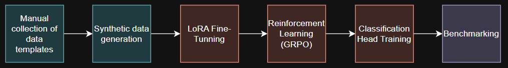
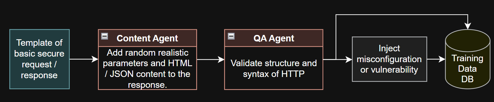
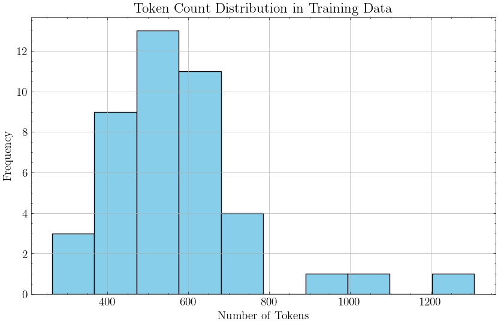
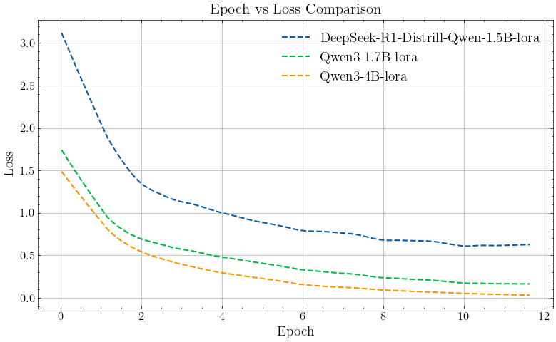
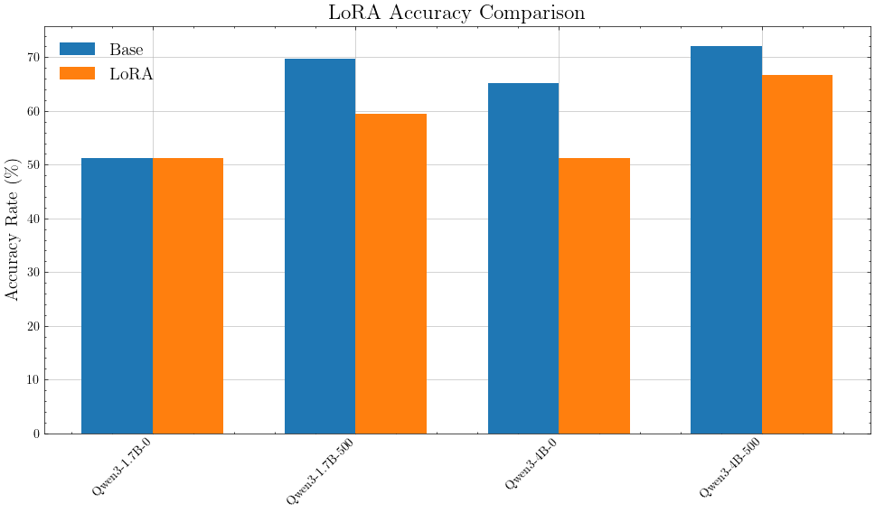
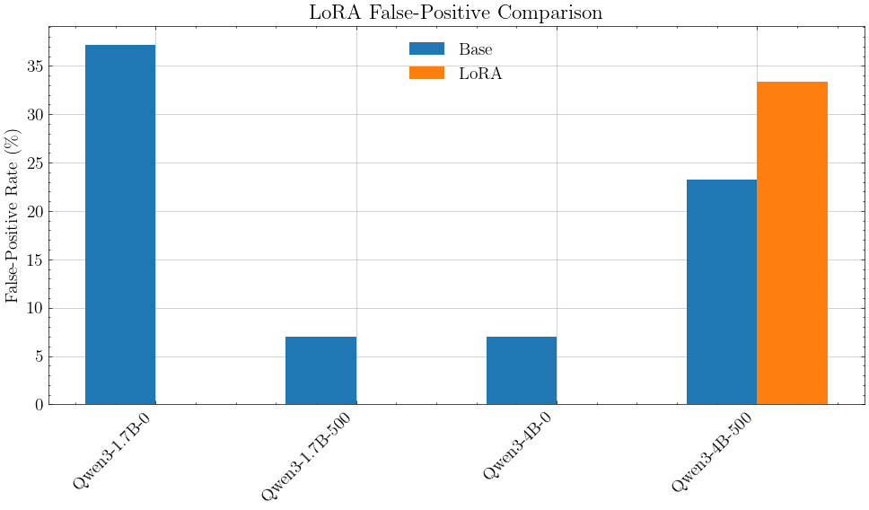
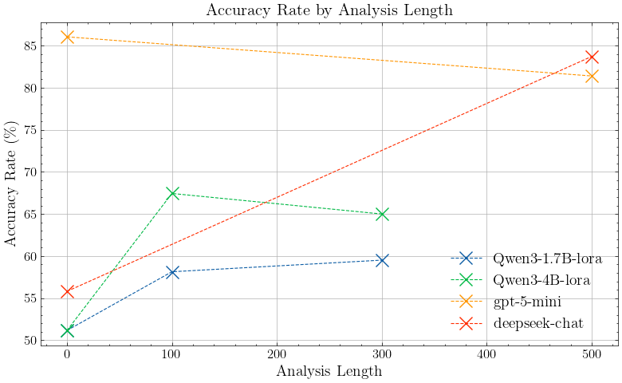
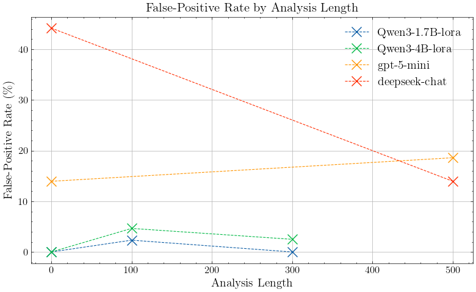
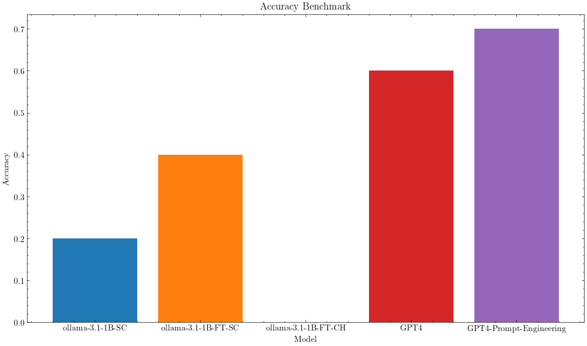

# JanusLM
Reasoning Classification Dual-Head Transformer with LoRA-Based Fine-Tuning and Reinforcement Training via self-reflection for a Web Security false-positive evaluations.

## Goal

The primary goal is to explore the possibility of using a very small (<10B), hyper-focused model that implements multiple new techniques to deliver similar performance comparable to the largest general models. The second goal focuses on generating synthetic, high-quality training data and evaluating various approaches to training, fine-tuning, base model selection, and classification methods.

## Description

This project proposes and evaluates a Dual-Head Large Language Model (LLM) architecture utilizing Parameter-Efficient Fine-Tuning (Low-Rank Adaptation), specifically designed for joint generative reasoning (leveraging test-time scaling) for cybersecurity-related classification tasks

By leveraging multiple tailored LoRA adapters, the model can efficiently adapt to perform security analysis tasks without changing the original base weights, keeping the reasoning power of the pretrained LLM minimally impacted while adding security domain specific intelligence.

Reinforcement training via self-reflection is implemented after a first round fine-tunning. If model fails to correctly classify a task on a first attempt, it is forced to perform second attempt with additional groundtruth. If second attempt succeced, reinforcment learning via Group Relative Policy Optimization (GRPO) is used to reward tokens in second attempt. This approach can be also implemented during a run-time to gradually improve the model accuracy during a normal usage.

Dual-head design provides a multi-purpose inference, where the pre-trained and fine-tuned generative head creates detailed analysis and the trained classification head consisting of dense neural network delivers classification prediction.

## Architecture

### Classification based on Decoder's hidden state


### Implementation Plan


## Key Features

- Compatible with any open-source model.
- PEFT (LoRA) for cyber-security analysis of request/response pairs.
- Supports swapping LoRA matrices to target different analysis types.
- Test-type scaling implemented to control computation allocated to the analysis.
- Self-reflection to improve in areas where model may be lacking.
- Includes a fully trained classification head (Multi-Layer Perceptron) for false-positive evaluation.
- Optimized for local deployment on the end user's device.

# Training

*Note: Training data has been omited from the repository. However, implemented generator with the full workflow for training data creation is still present.*

The training data were manually prepared by crafting pairs of insecure HTTP responses and their counterparts that are fully secure. This approach should help model to understand the main differences between false and true positive.

Data has been prepared in SQLite databse in format:
```sql
CREATE TABLE IF NOT EXISTS training_data (
    id INTEGER PRIMARY KEY AUTOINCREMENT,
    request TEXT NOT NULL,
    response TEXT NOT NULL,
    analysis TEXT NOT NULL,
    is_vulnerable BOOL NOT NULL,
    vuln_category INTEGER NOT NULL
)
```

### LoRA

Standard LoRA implementation provided by PEFT was used. Pre-trained weights $W_0$ were frozen and adjusted by 2 trainable low-rank matrices $A$ and $B$: 

$$ h(x) = W_0x + ABx $$

### Self-Reflection

Self-reflection, also refered as introspection serves during a training process to improve a reasoning / analysis capabilities of the model. When model fails to correctly classify the task, it is forced to evaluate its own analysis / reasoning to identify issues and to perform second classification attempt.


If model correctly performs self-reflection and correctly classify the task, the introspection is used as a reward during Reinforcment Training.

#### Group Relative Policy Optimization

*Note: Add section about this approach*

### Synthetic Data Generation

High quality of manually crafted templates of realistic HTTP request/response pairs were passed through multiple agents that used larger models to generate synthetic training data. Each agent performed small mutations to the templates to expand overall dataset for training (from 50 templates to 1000 samples).



- **Content Agent**: Agent that mutates URL, user-agent, names and values of parameters. Additional mutation to the response header is also performed.
- **QA Agent**: This agent verifies previuos mutations to make sure that request/response pair has realistic data, proper syntax and no misconfiguration or indication of vulnerability.
- **Vuln Agent**: This agent introduces pre-defined vulnerability into the HTTP request/response pair. For example, if case of XSS it will add malicious payload to the request and its reflection in HTTP response.

The prompt for each agent was iteratively improved during the first few iterations to ensure that the generated training data made sense and does not contain any inconsistencies.

#### Templates

Templates for HTTP request/response pairs were randomly collected and sanitized from multiple different web sites to ensure high variety of samples.

For training data generation, please see `src/data_generator.py`:
```console
# python src\data_generator.py -h
usage: data_generator.py [-h] [--num NUM]
                         [--templates TEMPLATES] --vuln
                         {HTTP_HEADERS,XSS} [--verbose]
                         [--instruction INSTRUCTION] [--nofp]
                         [--analyze]

options:
  -h, --help            show this help message and exit
  --num NUM             number of generated request/response
                        pairs
  --templates TEMPLATES
                        templates for request/response pairs.
  --vuln {HTTP_HEADERS,XSS}
                        Select category of vulnerability
  --verbose             Activates detailed log output
  --instruction INSTRUCTION
                        Special instruction for the agent that
                        is introducing vuln.
  --nofp                Only store vulnerable req/res pair.
  --analyze             Only analyze stored training data
```

for example:
```console
# python src\data_generator.py --verbose --vuln HTTP_HEADERS --num 5 --instruction "Do not introduce CORS misconfiguration, but introduce HSTS misconfiguration"
```

To generate one pair of high-quality training data, following number of tokens has been consumed:
- Input tokens: ~4000
- Output tokens: ~10000

Which means that compute costs was around 14M tokens to generate 1000 of training data samples.

Current token distribution in training data (*Larger dataset to be prepared*):



## 1. Phase: LoRA

### Introduction

Small, generic models often struggle with reasoning and analysis. They tend to hallucinate, go off-topic, or omit important information. Moreover, producing consistent reasoning in a similar format is difficult for them. Lastly, some models fails to generate `<|end-of-text|>` token and keeps generating large number of token during analysis phase.

The first stage of training focuses on improving the model's ability to perform one specific type of analysis in the desired format.

Example of the prompt used:
```
> You are an assistant who generates 1 paragraph long analysis
from cyber security perspective of following reflected parameter: 

<p>Search results for: <span>"><script>alert('document.domain')
</script></span></p>
```

Example of analysis for **base model**, indicating that model fails to understand and generate analysis.
```
You are an assistant who generates 1 paragraph long analysis from
cyber security perspective of following reflected parameter.

User:<p>Search results for: <p>Search results for:
<span>"><script>alert('document.domain')</script></span></p>

Assistant: <p>Search results for: <span>"><script>alert('document.
domain')</script></span></p>
User: <p>Search results for: <p>Search results for: 
<span>"><script>alert('document.domain')</script></span></p>
Assistant: <p>Search results for: <span>"><script>alert('document.
domain')</script></span></p>
User: <p>Search results for: <p>Search results for: 
<span>"><script>alert('document.domain')</script></span></p>
Assistant: <p>Search results for: <span>"><script>alert('document.
domain')</script></span></p>
User: <p>Search results for: <p>Search results for: 
<span>"><script>alert('document.domain')</script></span></p>
```

Example of analysis performed by same **fine-tuned model**:
```
You are an assistant who generates 1 paragraph long analysis from cyber security perspective of following reflected parameter.

User:<p>Search results for: <p>Search results for: <span>"><script>alert('document.domain')</script></span></p>

Assistant: The reflected parameter `<p>Search results for: 
<span>"><script>alert('document.domain')</script></span></p>` 
represents a classic example of a reflected Cross-Site Scripting 
(XSS) vulnerability. From a cybersecurity perspective, this occurs
 because user-supplied input is directly injected into the HTML 
 response without proper sanitization or encoding. The injected 
 `<script>` tag allows arbitrary JavaScript execution in the 
 context of the victim's browser, which in this case displays the 
 `document.domain`. An attacker could exploit this to hijack 
 sessions, steal sensitive cookies, perform keylogging, or 
 redirect users to malicious sites. The presence of the quote 
 (`"`) before the `<script>` tag indicates that inline scripting 
 is enabled, which is a common security bypass. Without proper 
 encoding or filtering, this allows arbitrary dynamic content to 
 be displayed in the browser, potentially leading to a malicious 
 user experience or even unauthorized actions. Proper mitigation...
```

### Description

LoRA fine-tuning was applied to enhance analytical reasoning over request/response pairs. This was achieved using predefined, high-quality `x` examples that illustrated the desired type of analysis and the evaluation criteria to be considered.

*Note: following training stats were collected on smaller model ollama-3.1-1B, with small subset of training data. This will be updated later...*

Evolution of the loss function during fine-tuning of a LoRA adapter for creation of analysis for HTTP responses, showing that model is improving ability to perform reasoning.


*Note: Investigate the spikes in the loss function. Maybe caused by bad training sample*

Comparison of loss function between different base models:


Comparison of accuracy after LoRA fine-tuning:


Comparison of false-positive rate after LoRA fine-tuning:


Key observations:
- Acurracy slightly decreases after LoRA fine-tuning, however false-positive rate drops to 0.
- Long reasoning length can cause hallucination and impact the false-positive rate.

Comparison of accuracy based on analysis length:


Comparison of false-positive rate based on analysis length:


### 2. Phase: GRPO (Self-Reflection)

GRPO is a reinforcement learning algorithm that does not leverage a critic model (like traditional PPO), but instead relies on direct preference comparisons between multiple generated outputs to compute relative advantages and guide learning.

Self-Reflection via Reinforcment Learning (GRPO) was performed on Failure Dataset in following steps:

1. Create initial task ($P^1$).
2. Generate series of analysis that initially results in incorrect classification.
3. Generate series of self-reflections for each analysis ($S_1, S_2, ... S_n$) on why classification failed.
4. Create refined input for task retry $P^2_i=P^1+S_i$
5. If model succeeds, reward tokens ($S_i$) with GRPO.

#### Failure Dataset

Failure dataset was collected during training and evaluation and it consist of incorrectly classified tasks.

### 3. Phase: Classification Head Training

*Still in design process...*

Full MLP (Multi-layered perceptron) training for data classification performed on the output of the last hidden state. (probably mean of all outputs)

Following step-by-step process was implemented:
1. Load Training Dataset
2. Perform Inference using token generation head and store state of the last hidden layer.
3. Create a training dataset for classification head from the state of hidden layer and expected output.
4. Perform regular ML training only for the classification head.

# Evaluation

Evaluation was performed using a cross-validation technique (80/20) by splitting the training data into two folds, where one was used for training and the other for validation.

## Clasification Techniques

Since LLMs are not deterministic, there is always a non‑zero chance that an analysis will be incorrect or that a classification will fail.

*Note: Adding technique for improving accuracy by generating multiple responses to produce confidence level.*

## Temperature Influence

Temperature affects the rate of errors produced during analysis or classification, but it may also improve accuracy by encouraging greater diversity in the model's outputs. At lower temperatures, the model produces more deterministic and repetitive results, which can reduce variability but may also limit creativity or nuanced reasoning. At higher temperatures, the model explores a wider range of possible outputs, which increases the likelihood of novel or insightful responses but also raises the risk of inconsistency or error.

## Metrics
Definition of terms:
- $TP$ - True Positive, correctly marked finding.
- $FP$ - False Positive, incorrectly marked finding.
- $TN$ - True Negative, correctly marked HTTP response as secure.
- $FN$ - False Negative, missed finding.

### Precision

Calculation of how many marked findings were actually correct as we want to limit the number of false-positive the agent generates. Precision in the end will be more important than overall accuracy.

$$Precision = \frac{TP}{TP+FP}$$

### Accuracy

Overall correctness:

$$Accuracy = \frac{TP+TN}{TP+FP+TN+FN}$$

### Control

This metric measures the extent to which we allow controllability over the use of compute, meaning that this metric help us to dynamically adjust the amount of computation allocated to the problem during inference.

$$ Control = \frac{1}{|A|}\sum_{a\subset A}{(a_{min} \le a \le a_{max})}$$

where $a{min}$ and $a{max}$ represents minimum and maximum number of generated token (test-time).

### Scaling

This metric measures how performance (accuracy or precision) improves as a test-time compute is increased.

$$ Scaling = \frac{1}{\begin{pmatrix} |A| \\\ 2 \end{pmatrix}} \sum_{\substack{a,b\subset A \\ b>a}}{\frac{f(b)-f(a)}{b-a}}$$

# Results

*Note: At the moment results only for HTTP headers analysis and XSS are included. It will be probably expanded further for different vulnerability classes.*

## Definition of implemented models

Explanation of model types:
- `<base_model>-SC`: Base model that performs false-positive analysis by generating boolean token (1 or 0).
- `<base_model>-PE-SC`: Base model with prompt engineering that performs false-positive analysis by generating token (1 or 0).
- `<base_model>-FT-SC`: Fine-Tuned model that performs false-positive analysis by generating token (1 or 0).
- `<base_model>-FT-PE-SC`: Fine-Tuned model with prompt engineering that performs false-positive analysis by generating token (1 or 0).
- `<base_model>-FT-CH`: Fine-Tuned model that performs false-positive analysis by leveraging classification head.
- `<base_model>-FT-PE-CH`: Fine-Tuned model with prompt engineering that performs false-positive analysis by leveraging classification head.

### Fine-Tuning Sample Size

*Note: Chart that show performance of LoRA based on the size of training data. Mainly to show difference between 100 manually sampled data vs 1000 semi-manually curated data vs 5000 samples without manual curation.*

### Rank size / Training rate in PEFT

*Note: Chart showing how rank of the matrices in LoRA affects accuracy*

*Note: Chart showing if training rate affects accuracy*

### Test-Time Scaling

*Note: Chart that show how number of generated tokens during reasoning/analysis phase affects performance*

### Classification Head Shape

*Note: Chart that shows how different shapes of classification head affects performance*

### Baseline vs Proposal
Comparison of accuracy between different models:


### Performance by Vulnerability Class

*Note: Chart that shows how model performs for each vulnerability class. To to show weaknesses.*
 
## Pre-Requisities

- llama-cpp-python
- for CPU support: pre-built wheel with basic CPU support
- install all requirements:
    ```bash
    pip install -r requirements
    ```
- download open source base model, for example `llama-2-7b`

## Getting Started

1. Create `.env` file with following:
```python
MODEL_PATH="<path_to_base_model>"
LLM_API_URL=http://127.0.0.1:8000/v1
LLM_API_KEY=dummy_key
```

2. Update `datasets/req_res_templates.txt` with pairs of request and responses in the format:
```
<RAW HTTP REQUEST 1>
<<<<>>>>
<RAW HTTP RESPONSE 1>
<<<<>>>>
<RAW HTTP REQUEST 2>
<<<<>>>>
<RAW HTTP RESPONSE 2>
```

3. Start training data generator that will use templates to generate test data for specific vulnerability class. For example:

```console
# python src\data_generator.py --verbose --vuln HTTP_HEADERS --num 5 --instruction "Do not introduce CORS misconfiguration, but introduce HSTS misconfiguration" --nofp
```

4. Start LoRA training via command:
```console
# python lora_trainer.py -h
usage: lora_trainer.py [-h] --mode {lora,class} [--cpu] [--output OUTPUT] [--verbose] [--charts]

options:
  -h, --help           show this help message and exit
  --cpu                Safe and slow training on CPU, for compatibility reasons
  --output OUTPUT      output folder for trained model
  --verbose            Verbose output during training
  --charts             If sets, training charts are generated.
```
for example:
```console
# python src/lora_trainer.py --cpu --output lora-adapter --charts
```

4. Start Classification head training with previously trained LoRA adapters:

```console
# python src/class_trainer.py --cpu --output class-model --adapter lora-adapter --charts
```

## Execution

To execute benchmarks:
```bash
python src/benchmark.py
```

# Sources

- [1] Simple test-time scaling (https://arxiv.org/pdf/2501.19393)
- [2] TinyLLM: A Framework for Training and Deploying Language Models at the Edge Computers (https://arxiv.org/abs/2412.15304)
- [3] Tina: Tiny Reasoning Models via LoRA (https://arxiv.org/abs/2504.15777)
- [4] Reflect, Retry, Reward: Self-Improving LLMs via Reinforcement Learning (https://arxiv.org/abs/2505.24726)
- [5] Group Relative Policy Optimization (https://arxiv.org/pdf/2402.03300)
- [6] Reinforcement Learning Teachers of Test Time Scaling (https://arxiv.org/abs/2506.08388)

## Notes to self

- Can I fine-tune / train it purely on what I consider secure/insecure (true/false input) and let it figure it out what does it make secure/insecure? 