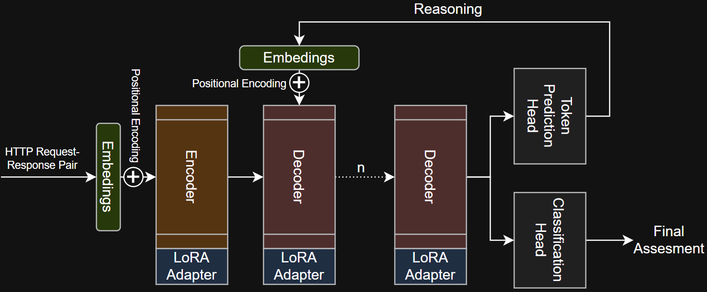
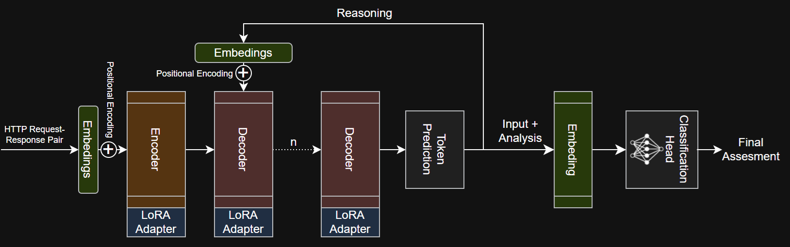

# JanusLM
Reasoning Classification Dual-Head Transformer with LoRA-Based Fine-Tuning for Web Security assesments.

## Description

This project proposes and evalutes a Dual-Head Large Language Model (LLM) Architecture with Parameter-Efficient Fine-Tuning (LoRA - Low-Rank Adaptation) designed for joint generative reasoning and cyber-security classification tasks.

By using LoRA (Low-Rank Adaptation), the model can efficiently adapt to perform security analysis tasks without changing the original base weights, keeping the reasoning power of the pretrained LLM minimally impacted while adding security domain specific intelligence.

Dual-head design provides a multi-purpose inference, where the pre-trained and fine-tuned generative head creates detailed analysis and the manually trained classification head delivers prediction.

## Goal

Locally served customized LLM that would be capable of analysing HTTP request / response pair and clasify it from the cyber-security perspective.

## Architecture

### Proposal 1: Classification based on Decoder's hidden state


### Proposal 2: Classification based on embedings


## Key Features

- This framework can be applied on any model.
- PEFT (LoRA) for analysis process on request / response pairs.
- Posibility to swap LoRA matrices for different analysis types.
- Fully trained Classification head (Multi-Layer Perceptron) for classification tasks.
- Designed to be locally hosted on user device.

## Training

### 1. Phase:
LoRA fine-tuning for improved analysis reasoning on request / response pair. To be performed via pre-defined high-quality `x` examples of what kind of analysis/reasoning should be performed.

Data to be prepared in the format:
```json
[{"input": "Analyze this HTTP request/response: GET /admin ...", 
 "output": "User provided request for admin interface without cookies with valid response, indicating that application can be accesses unauthenticated. Additionally, response was missing HSTS security header."},...]
```

### 2. Phase:
*Still in design progress...*

Full MLP (Multi-layered perceptron) training for data classification performed on the output of the last hidden state. (probably mean of all outputs)

Data to be prepared in the format:
```json
[{"input": "Analyze this HTTP request/response: GET /admin ... + reasoning", 
 "label": 0}]
```

## Evaluation

### Metrics
Definition of terms:
- $TP$ - True Positive, correctly marked finding.
- $FP$ - False Positive, incorrectly marked finding.
- $TN$ - True Negative, correctly marked input as safe.
- $FN$ - False Negative, missed finding.

#### Precision

Calculation of how many marked findings were actually correct:
$$Precision = \frac{TP}{TP+FP}$$

#### Accuracy

Overall correctness:
$$Accuracy = \frac{TP+TN}{TP+FP+TN+FN}$$

### Results
To be done:

1. Comparison of proposal 1 and proposal 2
2. Evaluation of different models on accuracy.
3. Evaluation of different size/shape of classification head on accuracy.
4. Evaluation of reasoning length on accuracy.
5. Evaluation of fine-tuning approaches / effect of sample size on accuracy.

## Pre-Requisities

- llama-cpp-python:
    pre-built wheel with basic CPU support:
    ```bash
    pip install -r requirements
    ```
- default model `llama-2-13b`

## Getting Started

1. Create `.env` file with following:
```python
MODEL_PATH="<path_to_llama-3.2-model>"
```

## Execution

```bash
...to be done...
```

